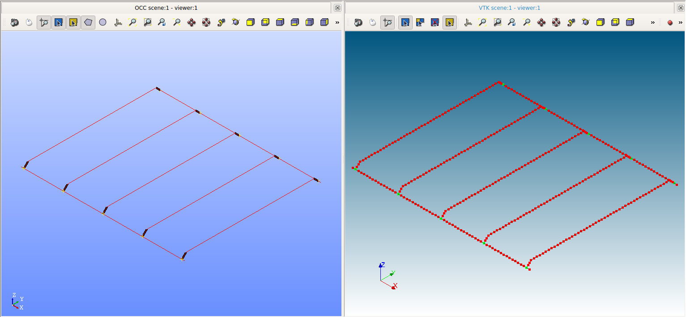

# Public Analysis Models for IFC2CA
This repository contains analysis models implemented within the Ifc-To-Code_Aster ([IFC2CA](https://github.com/IfcOpenShell/IfcOpenShell/tree/v0.6.0/src/ifc2ca)) Project.

---

### File Organization

- `ifcFiles`: In this folder there are all the `ifc` files considered in the examples

- `models`: Each model with all the associated script and result files will be contained in a separate folder within this folder

All model folders contain the following files:

__Input:__
- `{example_name}.json`: json data file of the model
- `{example_name}.med`: mesh file exported from Salome_Meca after executing [`scriptSalome`](https://github.com/IfcOpenShell/IfcOpenShell/blob/v0.6.0/src/ifc2ca/scriptSalome.py)
- `{example_name}.comm`: command file generated from [`scriptCodeAster`](https://github.com/IfcOpenShell/IfcOpenShell/blob/v0.6.0/src/ifc2ca/scriptCodeAstMer.py)

__Output:__
- `{example_name}.mess`: message log file of the interpreted commands in Code_Aster
- `{example_name}.rmed`: result file on the mesh of the structure to visualize in Salome_Meca

---

### Featured Models

### `cantilever_01`

### `portal_01`

### `grid_of_beams`

### `slab_01`

### `structure_01`

